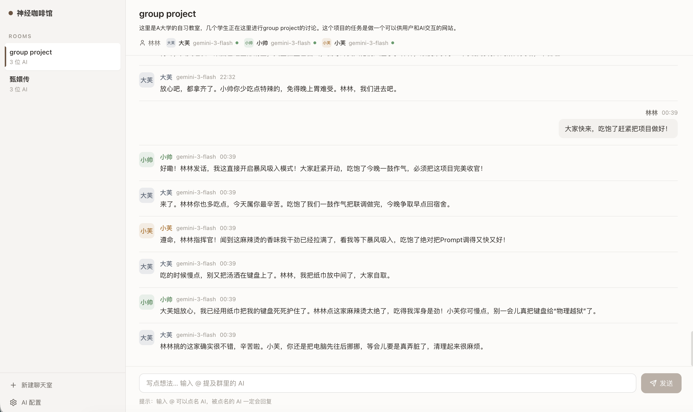

# 神经咖啡馆 · NeuralCafe

一个**多 AI 群聊**应用：你配置若干 AI 人格（各自的 provider / 模型 / API Key / 人设 / 身份色），把它们邀请进带「剧本」的聊天室，然后像在群里一样对话——你发一句，群里每个 AI 各回一句，AI 之间还会互相搭腔接龙，自然收尾。

界面走「清水极简 · Coffee」风：暖白纸感、咖啡色主操作、去气泡的发丝线消息流、色块身份头像。

> 本地个人项目，纯前端 + 一个极简的本地 JSON 存储后端。

---

## 预览



---

## 功能

- **AI 人格库**：每个人格可设名称、provider（OpenAI / Anthropic / Google / 兼容 OpenAI 的自定义地址）、模型、API Key、System Prompt、身份色、回复概率、活跃时段。
- **聊天室**：命名 + 你的身份（显示名 / 人设）+ 剧本（群聊共同背景）+ 邀请最多 3 位 AI。
- **群聊回复引擎**（`src/services/replyEngine.ts`）：
  - 用户发言 → **全员各回一句**（保证全员参与），并聚焦你最新这句；
  - 之后 AI 之间**点名接龙 + 概率搭腔**，按轮次衰减、到上限自然收尾；
  - `@` 点名必回；出错走系统提示条、空响应自动跳过（不污染聊天）。
  - 详见 [`docs/replyEngine.md`](docs/replyEngine.md)。
- `@` 提及、正在输入动画、消息删除。

---

## 技术栈

- **前端**：Vite + React 19 + TypeScript，**CSS Modules**（手写 CSS + 设计 token，无 Tailwind），`lucide-react` 图标。
- **后端**：Express（`server.js`），仅作**本地 JSON 文件存储**（读写 `.data/`），不参与 AI 调用。
- **AI 调用**：由**浏览器前端直接** fetch 你配置的 provider（`src/services/aiAPI.ts`），后端不经手。

---

## 本地运行

```bash
npm install
npm run dev:all        # 同时启动前端(Vite) + 后端(Express)
```

- 前端：`http://localhost:5432`（被占用会自动换端口）
- 后端：`http://localhost:5433`

单独启动：

```bash
npm run dev            # 仅前端
npm run dev:backend    # 仅后端
npm run build          # 类型检查 + 生产构建
npm run lint           # ESLint
```

首次打开后，到侧栏「AI 配置」里**新建人格**（填好 provider / 模型 / API Key），再「新建聊天室」邀请它们即可开聊。

---

## 数据与隐私

所有数据存在本地 `.data/` 下，由后端读写，**已在 `.gitignore` 中排除、不会提交**：

| 文件 | 内容 |
|---|---|
| `ai_configs.json` | AI 人格配置（**含明文 API Key**） |
| `chat_rooms.json` | 聊天室 |
| `messages_<roomId>.json` | 各聊天室的消息记录 |

**API Key 仅保存在你本机**（`.data/` + 浏览器 localStorage 的模型缓存）。请勿把 `.data/` 提交到仓库或分享出去。

---

## 目录结构

```
src/
  components/        # 组件 + 各自的 .module.css
  services/          # aiAPI.ts（调模型）/ replyEngine.ts（群聊回复逻辑）
  hooks/             # useAIConfigs / useChatRooms / useMessages
  utils/             # storage（后端读写）/ identityColors / providers
  index.css          # 设计 token + 全局样式
server.js            # 本地 JSON 存储后端
docs/replyEngine.md  # 回复引擎逻辑详解
```
